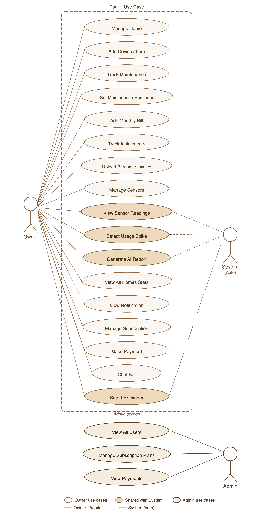

<div align="center">


<br>

# 🏠 DAR – Smart Home Care System

### دار – نظام ذكي للعناية بالمنزل

<table>
  <tr>
    <td align="center" bgcolor="#E8DED2">
      <br>
      <b>Smart home-care platform that helps users organize homes, manage maintenance tasks, track invoices and bills, receive intelligent reminders, and get AI-powered home-care insights.</b>
      <br><br>
      <b>منصة ذكية تساعد المستخدمين على تنظيم منازلهم، متابعة أعمال الصيانة، حفظ الفواتير والضمانات، استقبال التذكيرات الذكية، والحصول على توصيات مدعومة بالذكاء الاصطناعي للعناية بالمنزل.</b>
      <br><br>
    </td>
  </tr>
</table>

<br>


</div>

---

## 🌿 Project Overview | نظرة عامة على المشروع

<table>
  <tr>
    <td bgcolor="#E8DED2">
      <b>DAR</b> is a smart home-care system designed to help users manage and organize home maintenance in one place.
      <br><br>
      The platform supports homes, home items, maintenance tasks, reminders, bills, invoices, sensors, notifications, subscriptions, payments, and AI-powered smart recommendations.
      <br><br>
      <b>دار</b> هو نظام ذكي للعناية بالمنزل يساعد المستخدم على تنظيم منزله، متابعة الصيانة، إدارة الفواتير والضمانات، واستقبال التذكيرات الذكية في مكان واحد.
    </td>
  </tr>
</table>

---
## 🎬 DAR Prototype Demo


<p align="center">
  
</p>

## 🎬 Postman API Testing Demo 


<p align="center">
  
</p>


## ✨ Key Features

<table>
  <tr>
    <td>🏠 Home and room management</td>
    <td>🧰 Home item tracking</td>
  </tr>
  <tr bgcolor="#E8DED2">
    <td>🛠️ Maintenance scheduling</td>
    <td>⏰ Smart reminders</td>
  </tr>
  <tr>
    <td>📄 Bills and invoice management</td>
    <td>📈 Bill anomaly detection</td>
  </tr>
  <tr bgcolor="#E8DED2">
    <td>🤖 AI chatbot support</td>
    <td>🌦️ Weather-based maintenance advice</td>
  </tr>
  <tr>
    <td>🔔 Email, WhatsApp, and call notifications</td>
    <td>💳 Subscription and payment management</td>
  </tr>
</table>

---

## 🧭 Use Case Diagram



---

## 🗂️ ER Diagram

<table>
  <tr>
    <td bgcolor="#E8DED2">
      The ER Diagram represents the main database entities and relationships in the DAR platform, including users, homes, home items, maintenance records, reminders, bills, sensors, subscriptions, payments, and notifications.
    </td>
  </tr>
</table>

<br>


---

## 🔐 Authentication & Security

<table>
  <tr>
    <td bgcolor="#E8DED2">
      The system uses <b>JWT authentication</b> to protect user data and secure private endpoints.
    </td>
  </tr>
</table>

```http
Authorization: Bearer <token>
```

### Security Features

<table>
  <tr>
    <td>✅ JWT-Based Authentication</td>
    <td>✅ Stateless Session Management</td>
  </tr>
  <tr bgcolor="#E8DED2">
    <td>✅ Role-Based Access Control</td>
    <td>✅ Ownership Validation</td>
  </tr>
  <tr>
    <td>✅ Protected APIs</td>
    <td>✅ Secure User Resources</td>
  </tr>
</table>

---

## 🌐 Deployment

<table>
  <tr>
    <td bgcolor="#E8DED2">
      The backend is deployed on <b>AWS Elastic Beanstalk</b> with a production MySQL database hosted on <b>AWS RDS</b>.
    </td>
  </tr>
</table>

### Base URL

```http
http://Dar-env.eba-yke92rm3.eu-central-1.elasticbeanstalk.com
```

---

## 📬 Postman Collection

The project APIs are documented and tested using Postman.

[View Postman Collection](https://documenter.getpostman.com/view/37607702/2sBXwwo8e7)

The collection includes:

Authentication • User management • Homes • Home items • Maintenance • Maintenance reminders • Notifications • Bills • Purchase invoices • Sensors • Subscriptions • Payments • Chatbot


---

## 🧰 Tech Stack

<table>
  <tr bgcolor="#765345">
    <th><font color="white">Category</font></th>
    <th><font color="white">Technologies</font></th>
  </tr>

  <tr>
    <td><b>Backend</b></td>
    <td>
      
      
      
    </td>
  </tr>

  <tr bgcolor="#E8DED2">
    <td><b>Security</b></td>
    <td>
      
      
    </td>
  </tr>

  <tr>
    <td><b>Database</b></td>
    <td>
      
      
      
    </td>
  </tr>

  <tr bgcolor="#E8DED2">
    <td><b>Deployment</b></td>
    <td>
      
      
    </td>
  </tr>

  <tr>
    <td><b>AI & Automation</b></td>
    <td>
      
      
      
    </td>
  </tr>

  <tr bgcolor="#E8DED2">
    <td><b>Notifications</b></td>
    <td>
      
      
    </td>
  </tr>

  <tr>
    <td><b>Location & Maps</b></td>
    <td>
      
      
    </td>
  </tr>

  <tr bgcolor="#E8DED2">
    <td><b>Cloud Storage</b></td>
    <td>
      
    </td>
  </tr>

  <tr>
    <td><b>Testing & Documentation</b></td>
    <td>
      
      
    </td>
  </tr>

  <tr bgcolor="#E8DED2">
    <td><b>Build Tools</b></td>
    <td>
      
      
    </td>
  </tr>

</table>

---

## 📁 Project Structure

```text
DAR/
├── src/
│   ├── main/
│   │   ├── java/com/example/DAR/
│   │   │   ├── Controller/
│   │   │   ├── Service/
│   │   │   ├── Repository/
│   │   │   ├── Model/
│   │   │   ├── DTO/
│   │   │   ├── Security/
│   │   │   └── Config/
│   │   └── resources/
│   │       └── application.properties
├── docs/
│   ├── er-diagram.png
│   └── use_case.png
├── pom.xml
└── README.md
```


---

## ▶️ Run Locally

Follow these steps to run the project locally:

```bash
git clone <repository-url>
cd DAR
mvn clean install
mvn spring-boot:run
```

Make sure MySQL is running and the database configuration is set correctly before starting the application.

Example local database URL:

```properties
spring.datasource.url=jdbc:mysql://localhost:3306/dar_system
spring.datasource.username=root
spring.datasource.password=your_password
```

---

## 👩‍💻 Implemented Endpoints

This section highlights the main implemented API endpoints in the DAR backend.

### 🤖 Chatbot Endpoints

| Method | Endpoint                    | Description                                                  | Access                 |
| ------ | --------------------------- | ------------------------------------------------------------ | ---------------------- |
| `GET`  | `/api/v1/chatbot/questions` | Returns suggested chatbot questions for users.               | Public                 |
| `POST` | `/api/v1/chatbot/ask`       | Sends a user question to the chatbot and returns the answer. | Public / Authenticated |

---

### 🛠️ Maintenance Endpoints

| Method | Endpoint                                        | Description                                               | Access        |
| ------ | ----------------------------------------------- | --------------------------------------------------------- | ------------- |
| `GET`  | `/api/v1/maintenance/upcoming/{homeId}`         | Returns upcoming maintenance records for a specific home. | Owner / Admin |
| `GET`  | `/api/v1/maintenance/overdue/{homeId}`          | Returns overdue maintenance records for a specific home.  | Owner / Admin |
| `PUT`  | `/api/v1/maintenance/mark-done/{maintenanceId}` | Marks a maintenance record as completed.                  | Owner / Admin |

---

### ⏰ Maintenance Reminder Endpoints

| Method | Endpoint                                                         | Description                                             | Access        |
| ------ | ---------------------------------------------------------------- | ------------------------------------------------------- | ------------- |
| `POST` | `/api/v1/maintenance-reminder/add/{maintenanceId}`               | Adds a maintenance reminder for a maintenance record.   | Owner / Admin |
| `PUT`  | `/api/v1/maintenance-reminder/update/{id}/{homeId}/{homeItemId}` | Updates a maintenance reminder and validates ownership. | Owner / Admin |
| `PUT`  | `/api/v1/maintenance-reminder/mark-sent/{id}`                    | Marks a maintenance reminder as sent.                   | Owner / Admin |
| `GET`  | `/api/v1/maintenance-reminder/upcoming/{homeId}`                 | Returns upcoming reminders for a home.                  | Owner / Admin |
| `GET`  | `/api/v1/maintenance-reminder/today/{homeId}`                    | Returns today’s reminders for a home.                   | Owner / Admin |
| `POST` | `/api/v1/maintenance-reminder/send/{reminderId}`                 | Sends a maintenance reminder manually.                  | Owner / Admin |
| `PUT`  | `/api/v1/maintenance-reminder/reactivate/{reminderId}`           | Reactivates a reminder after it has been sent.          | Owner / Admin |
| `GET`  | `/api/v1/maintenance-reminder/summary/{homeId}`                  | Returns a summary of reminders for a home.              | Owner / Admin |
| `GET`  | `/api/v1/maintenance-reminder/ai-weather-advice/{homeId}`        | Generates AI weather-based maintenance advice.          | Owner / Admin |

---

### 🔔 Notification Endpoints

| Method   | Endpoint                                             | Description                                        | Access        |
| -------- | ---------------------------------------------------- | -------------------------------------------------- | ------------- |
| `PUT`    | `/api/v1/notification/mark-as-read/{notificationId}` | Marks one notification as read.                    | Owner / Admin |
| `PUT`    | `/api/v1/notification/mark-all-as-read`              | Marks all user notifications as read.              | Authenticated |
| `DELETE` | `/api/v1/notification/delete/{notificationId}`       | Deletes a notification.                            | Owner / Admin |
| `GET`    | `/api/v1/notification/summary`                       | Returns notification summary for the current user. | Authenticated |
| `POST`   | `/api/v1/notification/weather-alert/{homeId}`        | Creates a weather alert notification for a home.   | Admin         |
| `POST`   | `/api/v1/notification/smart-alert-intro/{userId}`    | Sends the smart alert introduction notification.   | Admin         |

---

### 💳 User Subscription Endpoints

| Method   | Endpoint                                    | Description                                    | Access |
| -------- | ------------------------------------------- | ---------------------------------------------- | ------ |
| `GET`    | `/api/v1/user-subscription/status/{status}` | Returns user subscriptions filtered by status. | Admin  |
| `DELETE` | `/api/v1/user-subscription/delete/{id}`     | Deletes a user subscription.                   | Admin  |

---

### 📈 Bill Endpoints

| Method | Endpoint                                | Description                                                    | Access              |
| ------ | --------------------------------------- | -------------------------------------------------------------- | ------------------- |
| `GET`  | `/api/v1/bill/get/anomalies/{homeId}`   | Get bills with abnormal consumption or unusual usage spikes.   | Admin or home owner |
| `GET`  | `/api/v1/bill/anomalies-count/{homeId}` | Count the number of detected consumption anomalies for a home. | Admin or home owner |

---

## 🔌 External APIs & Integrations

DAR uses external services to support smart features, automation, notifications, cloud storage, location services, and payments.

<table>
  <tr bgcolor="#765345">
    <th><font color="white">Service</font></th>
    <th><font color="white">Purpose</font></th>
  </tr>

  <tr>
    <td>
      
    </td>
    <td>Chatbot answers and AI maintenance advice</td>
  </tr>

  <tr bgcolor="#E8DED2">
    <td>
      
    </td>
    <td>Weather-based maintenance alerts and advice</td>
  </tr>

  <tr>
    <td>
      
    </td>
    <td>WhatsApp reminders and urgent calls</td>
  </tr>

  <tr bgcolor="#E8DED2">
    <td>
      
    </td>
    <td>Email reminders and notifications</td>
  </tr>

  <tr>
    <td>
      
    </td>
    <td>Subscription checkout and payment links</td>
  </tr>
  <tr>
    <td>
      
    </td>
    <td>Backend deployment</td>
  </tr>

  <tr bgcolor="#E8DED2">
    <td>
      
    </td>
    <td>Production database</td>
  </tr>
</table>

---

## 🤖 AI Features

<table>
  <tr>
    <td bgcolor="#E8DED2">
      DAR includes AI features to make home maintenance smarter, more proactive, and easier for users.
    </td>
  </tr>
</table>

<br>

<table>
  <tr>
    <td>🤖 AI chatbot to answer user questions about the platform.</td>
  </tr>
  <tr bgcolor="#E8DED2">
    <td>🌦️ AI weather-based maintenance advice for each home.</td>
  </tr>
  <tr>
    <td>🔔 Daily smart AI reminders for users with an active paid subscription.</td>
  </tr>
 
</table>

---


<div align="center">

<table>
  <tr>
    <td align="center" bgcolor="#E8DED2">
      <br>
      <b>DAR makes home care easier, smarter, and more organized.</b>
      <br><br>
      <b>دار يجعل العناية بالمنزل أسهل، أذكى، وأكثر تنظيمًا.</b>
      <br><br>
    </td>
  </tr>
</table>

</div>
